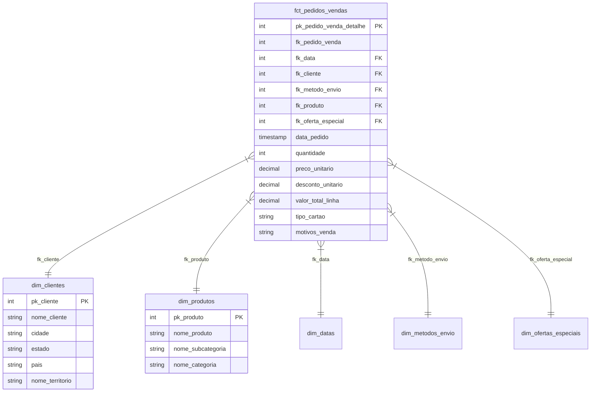

# CEA-AW: Analytics Engineering Pipeline - Adventure Works

Este projeto implementa um pipeline completo de Analytics Engineering utilizando dados da empresa fictícia Adventure Works. O pipeline engloba desde a extração de dados transacionais, transformação via dbt com arquitetura em camadas (Medallion / Dimensional), até a orquestração utilizando Databricks Asset Bundles (DABs).

## 🏗️ Arquitetura e Stack Tecnológica

O projeto foi construído usando as seguintes ferramentas:
- **PostgreSQL**: Serviu como banco de dados transacional (OLTP) de origem, simulando um ambiente produtivo.
- **Databricks (Lakehouse)**: Plataforma principal de processamento e armazenamento (Delta Lake).
- **dbt (Data Build Tool)**: Ferramenta responsável pela modelagem, transformação e testes de qualidade de dados.
- **Databricks Asset Bundles (DABs)**: Ferramenta de orquestração CI/CD (Infrastructure as Code) para deploy de jobs no Databricks.

## 🗂️ Modelagem de Dados

Optamos por uma modelagem dimensional estruturada nas seguintes camadas, respeitando as melhores práticas do dbt:

1. **Staging (Bronze/Raw):**
   - Importação direta das tabelas fonte (`adventure_works`), renomeando as colunas para um formato padronizado (snake_case e em Português) e fazendo o cast explícito de tipos de dados.
   - Aplicação de testes de integridade básica (`unique`, `not_null`) em chaves primárias.

2. **Intermediate (Prata/Silver):**
   - Junções (JOINs) entre entidades altamente normalizadas (ex: `Person` + `Customer` + `Address`).
   - Geração de uma espinha dorsal de datas (Date Spine) construída dinamicamente.
   - Desnormalização e agregação (ex: concatenar múltiplos motivos de venda num mesmo pedido).

3. **Marts (Ouro/Gold):**
   - Criação do **Star Schema** focado nas análises de vendas, expondo Views/Tables amigáveis ao negócio:
     - Fatos: `fct_pedidos_vendas` (com as chaves estrangeiras, métricas de negócio, tipos de cartão e motivos agregados).
     - Dimensões: `dim_clientes` (com localização geográfica), `dim_produtos` (com categorias e subcategorias), `dim_datas`, `dim_metodos_envio`, `dim_ofertas_especiais`.

### Diagrama do Modelo Dimensional (Star Schema)



## ✅ Qualidade e Testes de Dados

Para garantir a confiabilidade analítica, implementamos:
- Testes genéricos (chaves primárias únicas e não nulas).
- Relacionamentos mapeados nos arquivos `schema.yml` da camada Marts garantindo a Integridade Referencial.
- **Auditoria de Negócio (Singular Test):** Teste contábil auditando que o valor total de vendas brutas (Gross Sales) no ano de 2011 resultou exatamente no montante validado de **$12,646,112.16**.

## 🚀 Como Executar o Projeto

1. **Configuração e Ingestão:**
   Foi criado um script (`ingest_databricks.sh`) que extrai dados do PostgreSQL e envia via Databricks CLI para um Volume (`workspace.adventure_works.raw_data`). Depois, via SQL Editor do Databricks, as tabelas Delta são criadas a partir dos arquivos CSV.

2. **Deploy do Bundle:**
   Faça o deploy do código para o Databricks utilizando a CLI do Databricks:
   ```bash
   databricks bundle deploy --target dev
   ```

3. **Execução do Job (dbt build):**
   Rode o job do dbt remotamente no serverless SQL do Databricks:
   ```bash
   databricks bundle run cea_aw_dbt_job --target dev
   ```

## 📊 Dashboard de Negócios

Com as tabelas consolidadas geradas pela camada Marts no schema `dev_cea_aw_marts`, o dashboard atende às necessidades dos diretores e partes interessadas, fornecendo métricas estratégicas, como:
- Número de pedidos, quantidade comprada e valor total negociado.
- Análise de tickets médios.
- Top 10 Clientes e Top 5 Cidades com mais faturamento.
- Série temporal mensal de faturamento.
